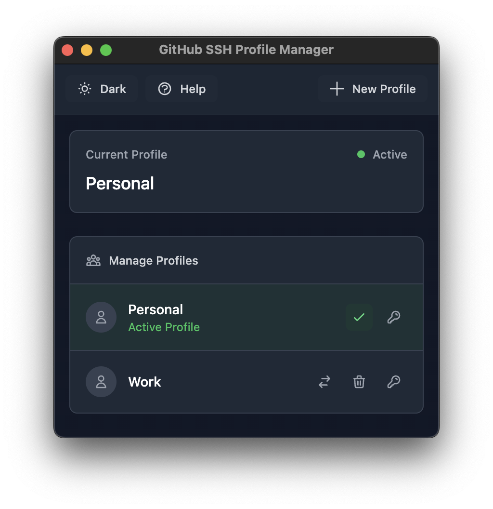

# GitHub SSH Profile Manager

A desktop application for easily managing multiple SSH profiles and GitHub configurations.

## Features

- Create and manage multiple GitHub SSH profiles for different accounts
- Seamlessly switch between GitHub SSH configurations with a single click
- Easily view and copy SSH public keys for GitHub authentication
- Optional GitHub token integration for enhanced functionality
- Dark/Light theme support to match your system preferences
- Clean, intuitive interface for managing your GitHub profiles

## Screenshots



## Prerequisites

- Node.js (v16 or higher)
- npm (v7 or higher)
- Git

## Build Instructions

1. Clone the repository:
   ```bash
   git clone https://github.com/zemichaelmd/github-ssh-profile-manager.git
   cd github-ssh-profile-manager
   ```

2. Install dependencies:
   ```bash
   npm install
   ```

3. Build the application:
   ```bash
   npm run build
   ```

4. Create distributable:
   ```bash
   npm run dist
   ```

The built application will be available in the `release` directory.

## Development

To run the application in development mode:

```bash
npm run dev
```

This will start the application with hot-reload enabled for development.

## Usage

1. Click "Create Profile" to add a new SSH profile
2. Fill in the required information:
   - Profile Name
   - Full Name
   - GitHub Username 
   - Email
   - GitHub Token (Optional)
3. Use the "Switch" button to activate a profile
4. View SSH public keys using the "Show ssh-rsa" button
5. Copy SSH public keys using the "Copy" button
6. Remove unwanted profiles with the "Remove" button

## Important

- This application is designed to work on macOS, and Linux.
- The application requires you to copy the ssh-rsa key and add it to your GitHub account.

## Tech Stack

- Electron
- TypeScript
- TailwindCSS
- Node.js

## Author

**Zemichael Mehretu**
- LinkedIn: [linkedin.com/in/zemichaelmd](https://linkedin.com/in/zemichaelmd)
- GitHub: [github.com/zemichaelmd](https://github.com/zemichaelmd)

## License

This project is licensed under the ISC License - see the LICENSE file for details.
